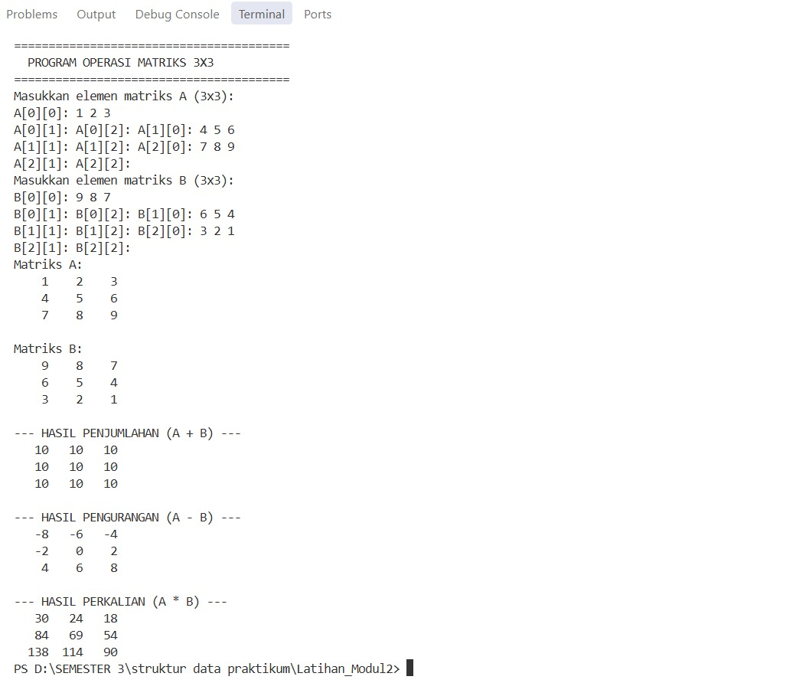
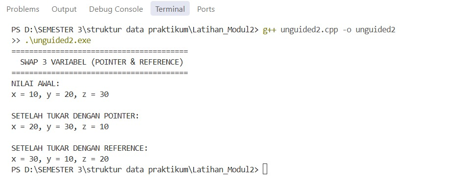
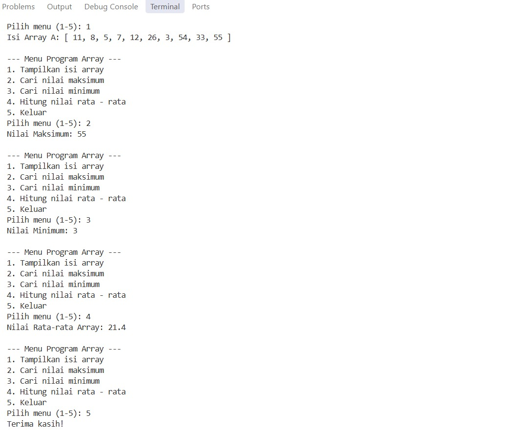

# <h1 align="center">Laporan Praktikum Modul 2 - Array Tiga Dimensi, Pointer, dan Struktur Data</h1>
<p align="center">Shasa Olivia Rose - 2311102xxx</p>

## Dasar Teori

Struktur data merupakan cara pengorganisasian, pengelolaan, dan penyimpanan data di dalam memori komputer agar data tersebut dapat diakses dan dimanipulasi secara efisien [1]. Pemahaman mengenai struktur dasar seperti larik (array) dan penunjuk memori (pointer) menjadi landasan penting dalam perancangan algoritma yang optimal.

### A. Array (Larik)<br/>
Array adalah struktur data linear homogen yang menyimpan sekumpulan elemen bertipe data sama dalam urutan sekuensial pada blok memori yang berkesinambungan (*contiguous memory*) [1]. 
#### 1. Array Satu Dimensi
Kumpulan elemen sekuensial yang diakses menggunakan sebuah indeks tunggal yang dimulai dari indeks ke-0.
#### 2. Array Dua Dimensi
Struktur tabular yang diorganisasikan dalam baris (*row*) dan kolom (*column*), umumnya merepresentasikan matriks matematis.
#### 3. Array Multi-Dimensi
Array yang memiliki dimensi tiga atau lebih, merepresentasikan data berelemen ruang spasial atau sekumpulan matriks bertingkat.

### B. Pointer dan Reference<br/>
Pointer dan reference memungkinkan manipulasi alokasi alamat memori secara langsung dan efisien pada arsitektur perangkat keras [2].
#### 1. Pointer
Variabel khusus yang menampung alamat memori dari variabel lain. Pointer dideklarasikan menggunakan operator dereference (`*`) dan memperoleh alamat memori menggunakan operator address-of (`&`).
#### 2. Reference
Alias atau nama alternatif untuk variabel yang sudah ada di memori. Modifikasi pada variabel reference secara langsung memengaruhi nilai variabel aslinya.
#### 3. Mekanisme Passing Parameter
Pengiriman argumen ke fungsi dapat dilakukan melalui *pass-by-value* (menyalin nilai), *pass-by-pointer* (mengirim alamat memori via pointer), atau *pass-by-reference* (mengirim alias variabel asli tanpa alokasi salinan data baru) [2].

---

## Unguided 

### 1. Operasi Penjumlahan, Pengurangan, dan Perkalian Matriks 3x3

Program ini melakukan operasi penjumlahan, pengurangan, dan perkalian dua buah matriks berordo 3x3 menggunakan struktur array 2 dimensi.

```cpp
#include <iostream>
using namespace std;

int main() {
    int matriksA[3][3], matriksB[3][3];
    int hasilTambah[3][3], hasilKurang[3][3], hasilKali[3][3];

    cout << "=== Input Matriks A (3x3) ===" << endl;
    for (int i = 0; i < 3; i++) {
        for (int j = 0; j < 3; j++) {
            cout << "A[" << i << "][" << j << "]: ";
            cin >> matriksA[i][j];
        }
    }

    cout << "\n=== Input Matriks B (3x3) ===" << endl;
    for (int i = 0; i < 3; i++) {
        for (int j = 0; j < 3; j++) {
            cout << "B[" << i << "][" << j << "]: ";
            cin >> matriksB[i][j];
        }
    }

    // Operasi Penjumlahan dan Pengurangan
    for (int i = 0; i < 3; i++) {
        for (int j = 0; j < 3; j++) {
            hasilTambah[i][j] = matriksA[i][j] + matriksB[i][j];
            hasilKurang[i][j] = matriksA[i][j] - matriksB[i][j];
        }
    }

    // Operasi Perkalian Matriks
    for (int i = 0; i < 3; i++) {
        for (int j = 0; j < 3; j++) {
            hasilKali[i][j] = 0;
            for (int k = 0; k < 3; k++) {
                hasilKali[i][j] += matriksA[i][k] * matriksB[k][j];
            }
        }
    }

    // Output Hasil Penjumlahan
    cout << "\n--- Hasil Penjumlahan ---" << endl;
    for (int i = 0; i < 3; i++) {
        for (int j = 0; j < 3; j++) {
            cout << hasilTambah[i][j] << "\t";
        }
        cout << endl;
    }

    // Output Hasil Pengurangan
    cout << "\n--- Hasil Pengurangan ---" << endl;
    for (int i = 0; i < 3; i++) {
        for (int j = 0; j < 3; j++) {
            cout << hasilKurang[i][j] << "\t";
        }
        cout << endl;
    }

    // Output Hasil Perkalian
    cout << "\n--- Hasil Perkalian ---" << endl;
    for (int i = 0; i < 3; i++) {
        for (int j = 0; j < 3; j++) {
            cout << hasilKali[i][j] << "\t";
        }
        cout << endl;
    }

    return 0;
}
Output Unguided 1 :

Output 1 (Input Matriks dan Hasil Operasi Penjumlahan & Pengurangan)
Output 2 (Hasil Operasi Perkalian Matriks)
Program di atas menggunakan nested loop (perulangan bersarang) untuk mengelola elemen baris dan kolom pada array 2 dimensi berukuran 3x3. Pada operasi penjumlahan dan pengurangan, elemen-elemen dihitung berdasarkan indeks posisi yang sama (C 
ij
​
 =A 
ij
​
 ±B 
ij
​
 ). Pada operasi perkalian matriks, digunakan perulangan tiga tingkat (i,j,k) untuk mengakumulasikan hasil kali baris matriks pertama dengan kolom matriks kedua sesuai rumus aljabar linear.

2. Pertukaran Nilai Tiga Variabel Menggunakan Pointer dan Reference
Program ini mendemonstrasikan pertukaran rotasi nilai dari tiga buah variabel menggunakan dua pendekatan alokasi: fungsi berbasis pointer (pass-by-pointer) dan fungsi berbasis reference (pass-by-reference).

#include <iostream>
using namespace std;

// Rotasi nilai: x -> y, y -> z, z -> x
void tukarPointer(int *a, int *b, int *c) {
    int temp = *a;
    *a = *c;
    *c = *b;
    *b = temp;
}

void tukarReference(int &a, int &b, int &c) {
    int temp = a;
    a = c;
    c = b;
    b = temp;
}

int main() {
    int x = 10, y = 20, z = 30;

    cout << "=== Demonstrasi Swap Nilai 3 Variabel ===" << endl;
    cout << "Nilai Awal             : x = " << x << ", y = " << y << ", z = " << z << endl;

    tukarPointer(&x, &y, &z);
    cout << "Setelah tukarPointer   : x = " << x << ", y = " << y << ", z = " << z << endl;

    tukarReference(x, y, z);
    cout << "Setelah tukarReference : x = " << x << ", y = " << y << ", z = " << z << endl;

    return 0;
}

Output Unguided 2 :

Output 1 (Hasil Eksekusi Nilai Awal dan Rotasi Pointer)
Output 2 (Hasil Eksekusi Rotasi Reference)
Fungsi tukarPointer menerima parameter berupa alamat memori dari masing-masing variabel (&x, &y, &z), lalu memanipulasi nilainya menggunakan operator dereference (*). Fungsi tukarReference menerima variabel secara langsung sebagai alias memori (int &a, int &b, int &c), sehingga pertukaran nilai di dalam blok fungsi langsung memengaruhi variabel asli pada fungsi main tanpa perlu melakukan dereference eksplisit.

3. Pengolahan Data Array 1 Dimensi Menggunakan Menu Switch-Case
Program ini melakukan analisis data numerik pada array 1 dimensi arrA = {11, 8, 5, 7, 12, 26, 3, 54, 33, 55} untuk mencari nilai minimum, maksimum, serta rata-rata melalui antarmuka menu berbasis switch-case.

#include <iostream>
using namespace std;

int cariMaksimum(int arr[], int n) {
    int maxVal = arr[0];
    for (int i = 1; i < n; i++) {
        if (arr[i] > maxVal) {
            maxVal = arr[i];
        }
    }
    return maxVal;
}

int cariMinimum(int arr[], int n) {
    int minVal = arr[0];
    for (int i = 1; i < n; i++) {
        if (arr[i] < minVal) {
            minVal = arr[i];
        }
    }
    return minVal;
}

void hitungRataRata(int arr[], int n) {
    double total = 0;
    for (int i = 0; i < n; i++) {
        total += arr[i];
    }
    cout << "Nilai Rata-rata : " << total / n << endl;
}

int main() {
    int arrA[] = {11, 8, 5, 7, 12, 26, 3, 54, 33, 55};
    int n = sizeof(arrA) / sizeof(arrA[0]);
    int pilihan;

    do {
        cout << "\n--- Menu Program Array ---" << endl;
        cout << "1. Tampilkan isi array" << endl;
        cout << "2. Cari nilai maksimum" << endl;
        cout << "3. Cari nilai minimum" << endl;
        cout << "4. Hitung nilai rata - rata" << endl;
        cout << "5. Keluar" << endl;
        cout << "Pilih opsi (1-5): ";
        cin >> pilihan;

        switch (pilihan) {
            case 1:
                cout << "Isi array: ";
                for (int i = 0; i < n; i++) {
                    cout << arrA[i] << " ";
                }
                cout << endl;
                break;
            case 2:
                cout << "Nilai Maksimum: " << cariMaksimum(arrA, n) << endl;
                break;
            case 3:
                cout << "Nilai Minimum: " << cariMinimum(arrA, n) << endl;
                break;
            case 4:
                hitungRataRata(arrA, n);
                break;
            case 5:
                cout << "Program selesai." << endl;
                break;
            default:
                cout << "Pilihan tidak valid! Silakan masukkan opsi 1-5." << endl;
        }
    } while (pilihan != 5);

    return 0;
}

Output Unguided 3 :

Output 1 (Menampilkan Isi Array dan Nilai Ekstremum)
Output 2 (Perhitungan Rata-rata Array dan Keluar Program)
Program ini memanfaatkan modularitas kode dengan memisahkan logika pencarian nilai ekstrem dan perhitungan statistik:

Fungsi cariMaksimum() dan cariMinimum() bertipe non-void dengan nilai kembalian integer yang didapatkan melalui iterasi linear perbandingan elemen secara berurutan.

Prosedur hitungRataRata() bertipe void bertugas mengakumulasikan seluruh nilai elemen ke dalam variabel bertipe double lalu membaginya dengan jumlah total elemen (n) untuk langsung mencetak nilai rerata secara presisi ke layar konsol.

Struktur perulangan do-while dan percabangan switch-case menyediakan antarmuka interaktif yang terus aktif hingga pengguna memilih opsi keluar (opsi 5).

Kesimpulan
Praktikum modul ini memberikan pemahaman komprehensif mengenai pengolahan data menggunakan array serta manajemen alamat memori dengan pointer dan reference:

Array dua dimensi sangat efektif digunakan untuk pemodelan data berbentuk matriks, di mana manipulasi elemennya dapat diselesaikan melalui perulangan bersarang (nested loop).

Pointer dan reference memberikan kontrol langsung terhadap variabel di tingkat memori. Penggunaan parameter pass-by-reference dan pass-by-pointer memungkinkan sebuah fungsi memodifikasi nilai variabel asli secara efisien tanpa memerlukan alokasi memori tambahan untuk menyalin data (pass-by-value).

Penggabungan array satu dimensi dengan modularitas function, prosedur, dan menu percabangan switch-case menghasilkan kode program yang terstruktur, modular, dan mudah dipelihara.

Referensi
[1] Triase. (2020). Diktat Edisi Revisi : STRUKTUR DATA. Medan: UNIVERSITAS ISLAM NEGERI SUMATERA UTARA MEDAN.

[2] Indahyati, U., & Rahmawati, Y. (2020). Buku Ajar Algoritma dan Pemrograman dalam Bahasa C++. Sidoarjo: Umsida Press. https://doi.org/10.21070/2020/978-623-6833-67-4